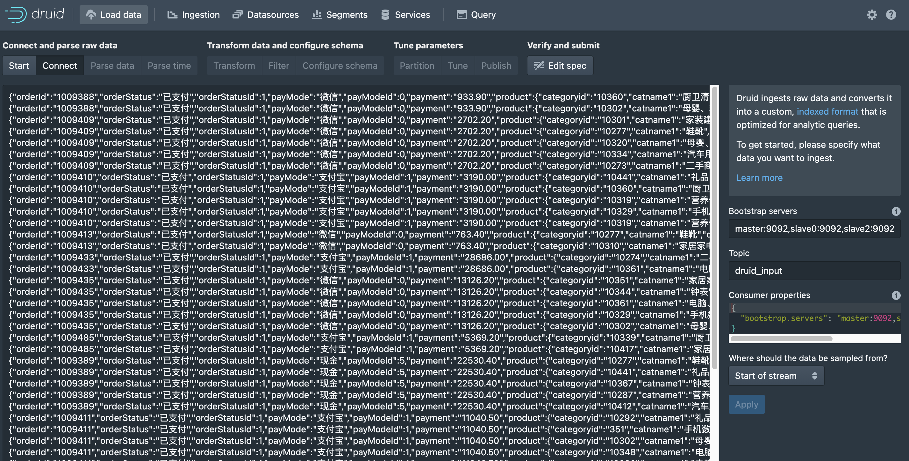
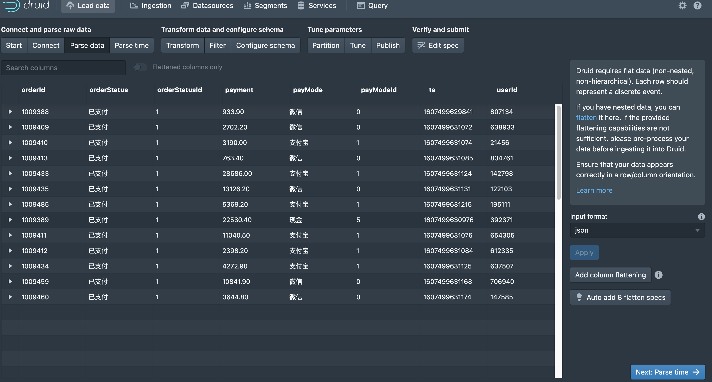
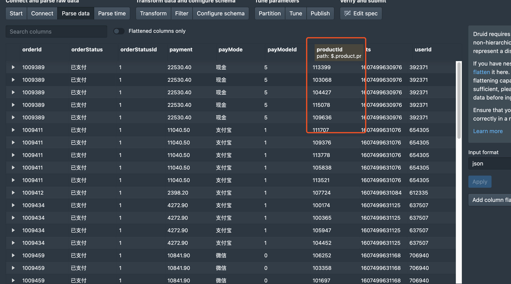
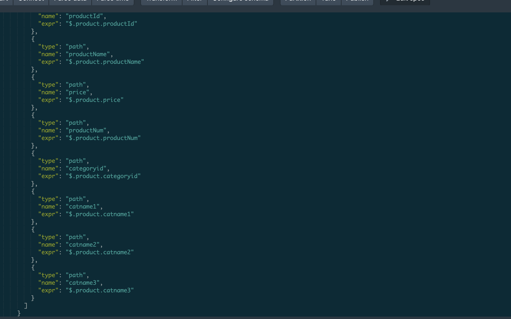
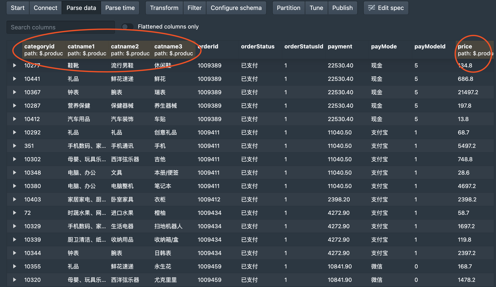
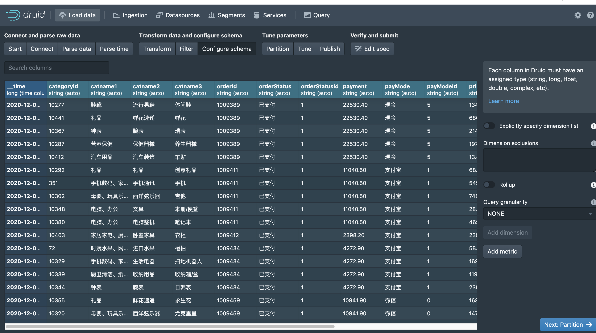

## Druid作业

flink处理见代码

下面用图例标注Druid操作

1. 新建数据源

   

2. 解析数据源

   

   有与product的相关信息没有解析到该类型里面，需要添加flattening

   先添加一个column flattening如下图

   

   通过EditSpec将其他列添加进去

   

   解析后的结果如图：

   

